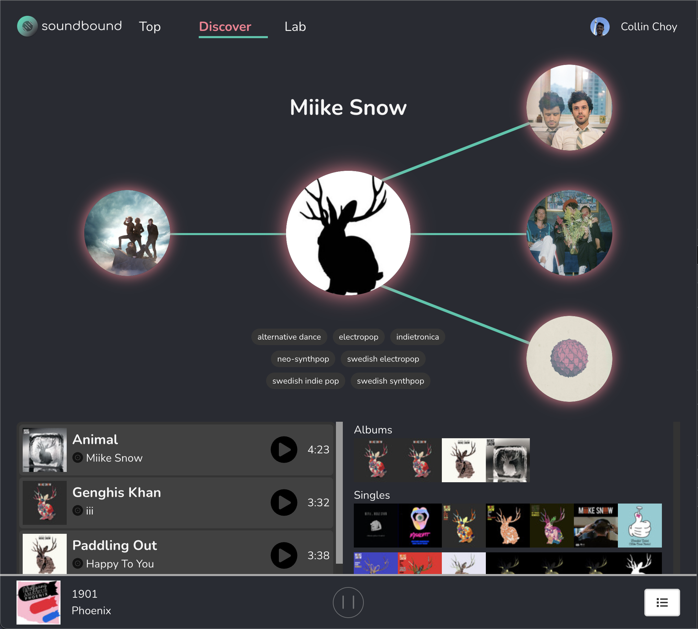

# **Soundbound**

View the app live at [https://collincchoy.github.io/soundbound/](https://collincchoy.github.io/soundbound/).

Built with the Spotify API, TypeScript, and React.

## Screenshots

## Features

### Login with Spotify

### Top Tracks & Artists
  - 3 different periods
    1. long_term (calculated from several years of data and including all new data as it becomes available)
    2. medium_term (approximately last 6 months)
    3. short_term (approximately last 4 weeks)
  - Play quick 30 second previews of tracks - Great for finding music!

### Discover Graph
  - Interactive SVG-based graph to journey through related artists

### Music Player (30-second previews)
  - Basic track info
  - Play/Pause track
  - Add to and View Play Queue

### Lab
  - Generate playlists given 1 artist, track, and/or genre
  - Filter(_or prefer_) by a slew of track attributes like acousticness, danceability, energy, instrumentalness, key, liveness, loudness, mode(major/minor), popularity, speechiness, tempo, time signature, valence(high = more positive (e.g. happy, cheerful, euphoric), low = more negative (e.g. sad, depressed, angry))

